## Term 1 Assignment 3 Josh Phillips - Procedually generated maze game

#### [Link to git repository](https://github.com/jophc1/JoshuaPhillips_T1A3)
#### [Link to Youtube presentation](youtube link here)

### Styling guide
PEP 8, [styling guide link here](https://peps.python.org/pep-0008/)

### Features of Maze game

#### Feature 1: Random Generation of a maze
When this maze game application is ran, a set of parameters will be asked for from the User in the terminal. These parameters will be for the size of the row & columns of the maze and the complexity of the maze (choose from easy, medium or hard).   

This feature will be related to using these parameters provided by the user with a specially created algorithm that will use multiple procedures that will be responsible for the randomised correct path of the maze, the creating of fake paths and the establishment of start & end points for our maze. This algorithm will be be heavily relient on looping structures like for and while loops to reduce the amount of repeated code, will need to utilize error handling to check that the inputted parameters are valid or within the limits of the game, and will use functions to split up the algorithm into smaller manageable pieces to allow better code readability and debugging.

#### Feature 2: Terminal play of generated maze, single maze mode
This feature is to create a playable gaming mode that is offered by our maze generation application. This feature is for the traversal of our generated maze through the terminal by inputting certain keys, where our position in the maze can be represented by a special character (@) and the end point will be represented by an 'X'. Our position will begin at the start point on the left part of the maze and will need to use inputs (e.g. using w,a,s,d to indicate direction) to navigate through maze till we hit the end, to where we win and asks us if we want to play another game.   

#### Feature 3: Setting maze wall colour
This feature is changing the colour of the walls for the generated ascii maze. As a .txt file cannot have colours, this feature will coincide with feature 2 where the user will have a selection of several different colour. This will also include the colour being applied to a test maze before the actual maze is generated to show to the user what the maze will look like and if they want to confirm the colour choice. 

#### Feature 4: Output generated maze into a .txt file for a printable maze puzzle
This feature is for the creation of a mode that will generate a randomised maze, export it into a .txt file in the form of ASCII. By putting our maze as ASCII into a .txt file, we can print this out and enjoy our maze without needing to use a computer.   


### Implementation plan
[Link to trello board](https://trello.com/b/K57IXMnw/procedual-generated-maze-game-josh-phillips)

#### Trello board screenshots

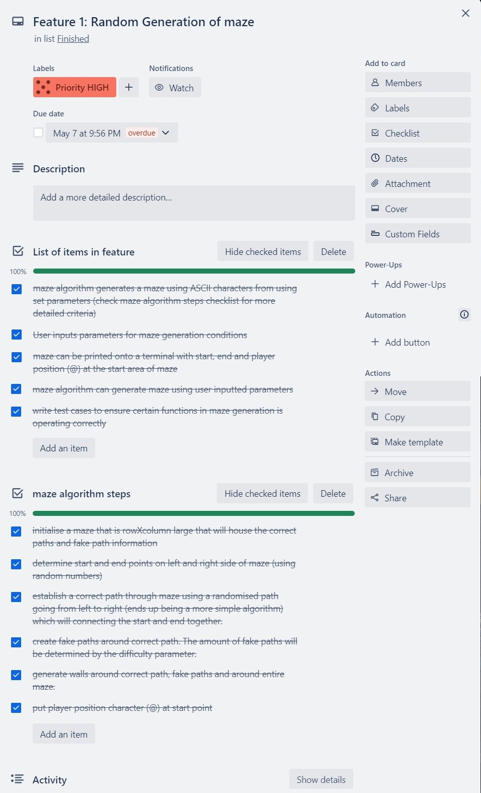
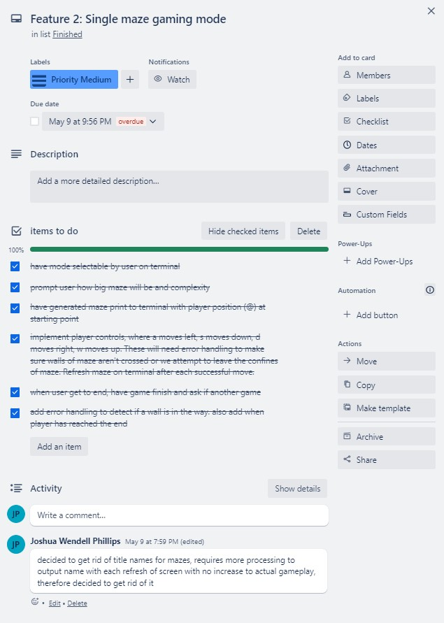
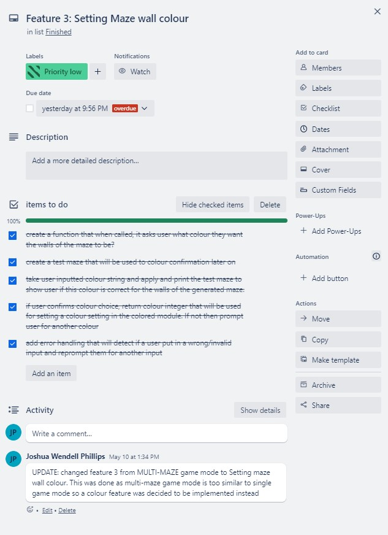
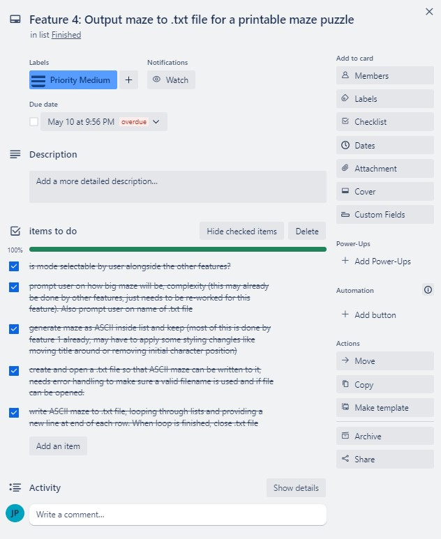
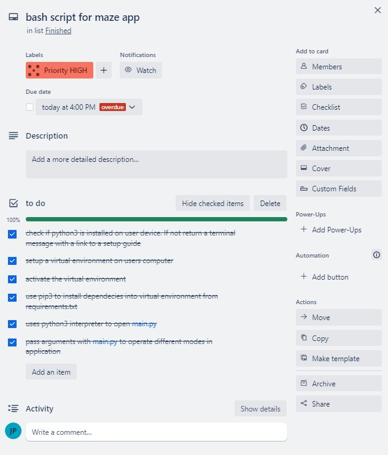 

#### Feature 1: Random Generation of a maze 
This feature is responsible for the randomised generation of our mazes and is our most important feature as it is required by all other features. This requires us to start and finish this feature before other work on the app can be done. To show the importance, we highlight this as a HIGH PRIORITY in the project management platform software (Trello, link above).   

We can break this feature down into a checklist of items that will be required to be completed:
1. Need to allow a users to be able to input values to give us our maze generation parameters.
2. Develop a maze algorithm to generate a maze with an ASCII representation by using known parameters (important to demonstrate that our algorithm works).
3. Test if our maze algorithm can generate a maze with ASCII output with user inputted parameters.
4. Implement a way to print a generated maze onto the terminal with ASCII representation with a start, end and player position (e.g. @) that will be at the start area of the maze.

Our second checklist item, development of maze algorithm, can be further broken down into its own checklist:
1. Randomise the start and end positions for the maze. Start is on left side of maze and end is on right side of maze.
2. ~~Determine the length of correct path through the maze. This will be affected by difficulty level of maze (harder it is, the longer the path).~~ This step was changed as the difficulty was implemented differently. Ended up not predetermining the path length as it makes the game more predictable.
3. Create a correct path through maze by randomising direction going from left side to right side of maze, ensuring the start and end positions are connected.
4. Use the difficulty input from user to determine the amount of fake 
5. Create fake paths around correct path, having entry from correct path but no exit with the fake paths (i.e they are forced to track back to correct path).
6. Generate ASCII corridors around correct and fake paths. Also generate walls around maze.
7. Put player position character (@) at start position of maze.

#### Feature 2: Single maze gaming mode
When our feature 1 is tested and completed, we can start the development of our second feature which is responsible for one of three gaming modes where a user can use keyboard inputs to tranverse the player position (+) in the maze from the start point to the end point through the terminal. As this feature is reliant on the completion of feature 1, the priority is set to MEDIUM. This feature will contain the following checklist:
1. Is single maze mode selectable by the user on the terminal?
2. When mode is selected, prompt user on maze parameters i.e how big is maze, complexity, name of maze.
3. Generate maze using user parameters and output onto terminal with player position (+) at start position.
4. Implement keyboard controls where 'a' moves left, 's' moves down, 'd' moves right and 'w' moves up. Check each move to make sure not hitting wall, else update maze and refresh terminal to display maze with new player position.
5. When end of maze is reached, prompt user if they want another game.

#### Feature 3: Setting Maze wall colour
The feature to change the colour of the generated maze ascii text can only be implemented when feature 2 single maze gaming mode is completed as it will complement the maze gaming experience, so in terms of priority it has been set to LOW as it is one of the last items that will be finished in the entire project. The checklist for this feature will be:
1. Create a prompt for a user to ask what colour they want from a small list
2. Create a small test maze with walls. This will be used for colour confirmation later on.
3. Take the users inputted colour choice and apply it to the test maze. Print test maze to screen and ask for confirmation from user if they want to keep colour choice.
4. Add error handling with how colour is chosen. Detect if a user puts in a wrong value and also have it where if user isn't happy with colour, then reprompt for another choice.
5. When user confirms colour choice, use this colour with an imported package to change the maze colour

#### Feature 4: Output maze to .txt file for a printable maze puzzle
This feature is for the outputting of a maze to a .txt file in the form of ASCII art. This will allow a user to generate and print a maze so that they may play it offline without the need for the app. This feature has the same priority as feature 2 (MEDIUM) as either of them can be worked on first without affecting the project timeline. The following checklist will need to be done:
1. Create a function for txt file generation that will be able to be called on when the user selects a .txt file with a generated maze.
2. Prompt user on size and complexity of the generated maze. Also prompt user on what the name of the .txt file shall be.
3. Check if filename that user provides is valid and if there isn't a current file with the same name. If valid but there is a current file, prompt user if they wish to overwrite.
4. Generate a ascii maze based on user parameters and convert in a string list, where rows of maze are changed to a string.
5. Open filename provided by user and set to write. Now write each string line of maze into .txt file. When finished, close .txt file and exit program.

### Help Documentation
#### System/Hardware requirements
This maze generator application requires Python3. If you need to install Python3 you can follow this beginner guide [here](https://wiki.python.org/moin/BeginnersGuide/Download) for the operating system you will use for the application.   

This application in conjunction with Python3 will also require the installation of 'pip', which has a guide of installation [here](https://packaging.python.org/en/latest/guides/installing-using-pip-and-virtual-environments/). The virtual environment 'venv' comes standard with python 3.3 and onwards so there is no installation needed if your python version is 3.3 or onwards.

#### Required dependencies
This application is dependent on the following python packages:

colored (version 1.4.4)
exceptiongroup (version 1.1.1)
iniconfig (version 2.0.0)
packaging (version 23.1)
pluggy (version 1.0.0)
pytest (version 7.3.1)
tomli (version 2.0.1)

#### Installation process
Locate src directory path of application in terminal
e.g 
```jophc@jophc1:~/JoshuaPhillips_T1A3/src$```

While the execute rights for the mazescript.sh should already be allowed, you can activate again with:

```chmod +x mazescript.sh```

Now the mazescript.sh wrapper script can be run by: 

```./mazescript.sh {argument}```

with {argument} replaced with either 'single', 'text' or 'help' e.g.

```./mazescript.sh help```

Regardless of argument used, the first time mazescript.sh is run, a virtual environment .venv folder will be created and activated and the automated downloading and installation of dependecies will be performed. After the dependencies have finished installing, the maze generator application will be ran.

**Note: if dependencies downloaded and installed successfully, disregard the next step**
 Usually the mazescript.sh script will automate package downloading and installation, however in the case of an error, the dependecies above can manually be downloaded and installed through an virtual environment. The virtual environment is setup and activated by the two commands: 

```
python3 -m venv .venv
source .venv/bin/activate
```
The virtual environment will now show on your command prompt line as (or similar):

```(.venv) jophc@jophc1:~/JoshuaPhillips_T1A3/src$```

When your virtual environment is activated, now each dependicies can be manually downloaded and installed by using:
 
python3 -m pip install (name_of_package)==(version_number)

e.g. ```python3 -m pip install colored==1.4.4```

#### How to use application
To open the maze generator application, the bash script wrapper mazescript.sh will need to be ran in terminal at the src directory of application e.g.
``` jophc@jophc1:~/JoshuaPhillips_T1A3/src$ ./mazescript.sh {argument}```

./mazescript.sh has several arguments that can be inputted to replace {argument} in the above code snippet:

``./mazescript.sh single`` This will operate the single maze gaming mode of the maze generator application.

``./mazescript.sh text`` This will generate a maze according to user parameters, creation and open a .txt file and write the generated maze to this .txt file. The file will be saved into the src directory.

``./mazescript.sh help`` Gives a better description of the arguments that can be used with mazescript.sh

##### Single maze game mode
This is accessed by the command ```./mazescript.sh single``` which when run takes you to a prompt asking for maze dimension sizes, difficulty and maze wall colour:

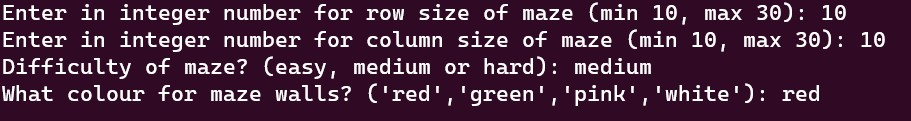

When values are inputted, a prompt will ask for confirmation of wall colour:

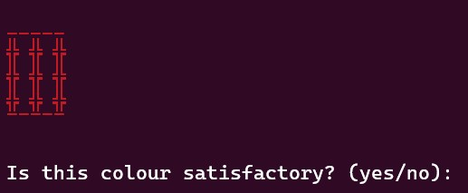

If colour is confirmed, a maze in that colour will be generated, otherwise a new colour is asked for:

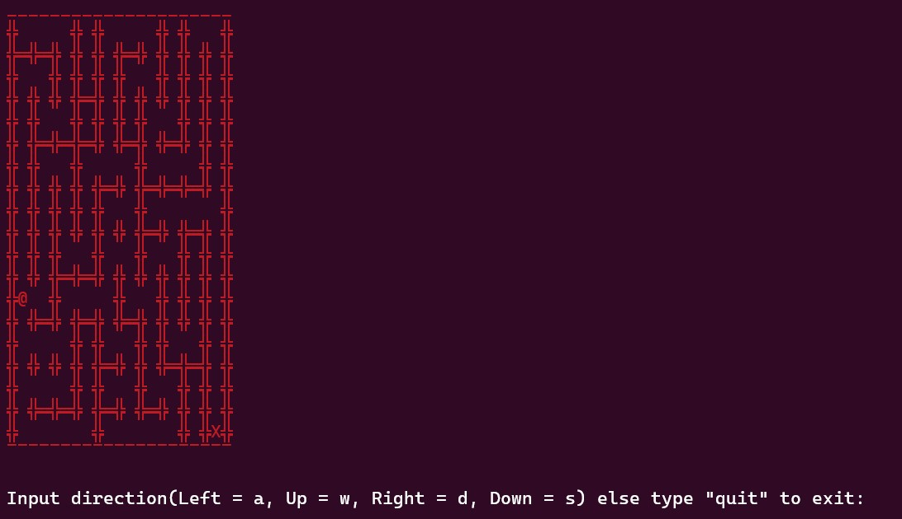

Now the maze can be played by moving the @ player to the X in the maze by using w,a,s,d controls to move. When the end is reached, a prompt will ask if you want to play another game.

##### Saving a maze into a .txt file
To save a maze as an ascii format into a .txt file, the command ```./mazescript.sh text``` is used, which prompts you for a name of the file:

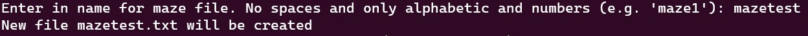

If the filename doesn't exist, a new file will be created, otherwise a prompt will ask if you want to overwrite the existing file.

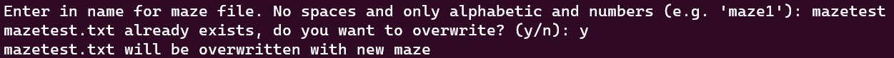

The user will now be prompted for maze parameters for size and difficulty:

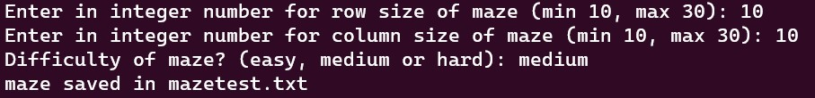

This is the output for this example (located in src directory):

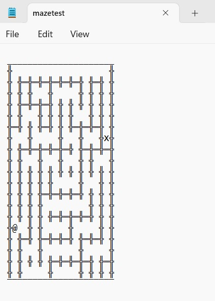
